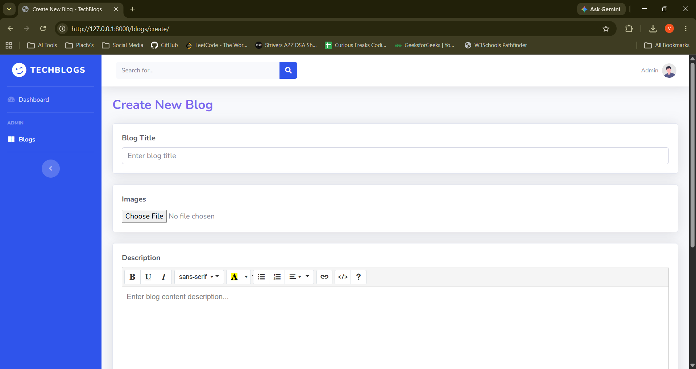

# TechBlogs - Django Blog Web Application (Features)

TechBlogs is a premium, fully-featured, AJAX-driven blog management application integrated with the **SB Admin 2** theme framework. It supports server-side pagination, database queries, and rich text editing components.

## 🚀 Key Features

- **AJAX CRUD Operations**: Asynchronous Creation, Updating, Deleting, and Reading without full page reloads.
- **Server-Side DataTables**: Integrated with `django-ajax-datatable` for rendering, sorting, pagination, and data retrieval.
- **Multi-Selection Filters**: Toggable category dropdown matching multiple filters dynamically (e.g. *Python*, *Django*, *Scrapy*), showing selection counters.
- **Global Search**: Submitting the topbar search input filters records instantly on the dashboard or redirects and pre-filters from secondary pages.
- **Rich Text Editor**: Integrated with **Summernote Lite** for rich document descriptions.
- **Select2 Tagging**: Dynamic tag creation chip input fields.
- **Responsive Layout**: Fluid design layout compatible with mobile and desktop browsers.
- **SweetAlert2 Alerts**: Modern confirmation overlays for deleting entries and successful saves.

---

## 📸 Screenshots

### 1. Blogs Dashboard List


### 2. Create Blog Page


### 3. Edit Blog Modal


### 4. Blog Details View


### 5. Success Alerts


### 6. Delete Alerts


---

## 🛠️ Installation & Setup

Follow these steps to run the project locally on your machine:

### 1. Clone the Repository
```bash
git clone https://github.com/vishalinipg/blog-web-application.git
cd blog-web-application
```

### 2. Initialize Virtual Environment
Create and activate a Python virtual environment:
```powershell
# Create virtual environment
python -m venv .venv

# Activate virtual environment
.venv\Scripts\Activate.ps1
```

### 3. Install Dependencies
Install all required packages:
```bash
pip install django django-ajax-datatable pillow
```

### 4. Apply Database Migrations
Generate and apply migrations to build the SQLite database schema:
```bash
python manage.py makemigrations
python manage.py migrate
```

### 5. Run Development Server
Start the local server:
```bash
python manage.py runserver
```
Visit `http://127.0.0.1:8000/` in your browser.

---

## 🗄️ Database Architecture

The `Blog` model consists of the following attributes:
* `title`: CharField (Blog Title)
* `content`: TextField (Rich text body description)
* `image`: ImageField (Cover photo, optional)
* `category`: CharField (Choices: Python, Django, PowerBI, Scrapy)
* `tags`: CharField (Comma-separated string tags list)
* `publish`: BooleanField (Publish status toggle)
* `created_at`: DateTimeField (Auto-generated timestamp)
* `updated_at`: DateTimeField (Auto-updated timestamp)

---

## 🔗 URL Routing & API Endpoints

The application registers the following app-namespaced routes:

| URL Pattern | View Name | Description | HTTP Method | Request Type |
| :--- | :--- | :--- | :--- | :--- |
| `/` | `list` | Renders dashboard wrapper and master template | `GET` | Standard |
| `/blogs/datatable/` | `datatable` | Server-side data source for ajax-datatables | `POST` | AJAX (JSON) |
| `/blogs/create/` | `create` | Renders full-page form (GET) / processes creation (POST) | `GET`/`POST` | Form Redirect |
| `/blogs/<int:pk>/edit/` | `edit` | Fetches details (GET) / saves changes (POST) | `GET`/`POST` | AJAX (JSON) |
| `/blogs/<int:pk>/` | `detail` | Renders single blog post detail view | `GET` | Standard |
| `/blogs/<int:pk>/delete/` | `delete` | Handles deletion and media file cleanup on disk | `POST` | AJAX (JSON) |

---

## 📝 License & Credits

* Table structures powered by [django-ajax-datatable](https://github.com/c-solidum/django-ajax-datatable).
* Text formatting editor powered by [Summernote Lite](https://summernote.org/).
* Multi-select elements styled via [Select2](https://select2.org/).
* Dashboard layout based on the open-source [SB Admin 2 Template](https://startbootstrap.com/theme/sb-admin-2).
```
