# TechBlogs - Django Blog Web Application (Features)

TechBlogs is a premium, fully-featured, AJAX-driven blog management application integrated with the **SB Admin 2** theme framework. It supports server-side pagination, database queries, and rich text editing components.

---

## 🚀 Key Features

### 1. Core Functionality
*   **AJAX CRUD Operations**: Asynchronous Creation, Updating, Deleting, and Reading without full page reloads.
*   **Server-Side DataTables**: Integrated with `django-ajax-datatable` for rendering, sorting, pagination, and data retrieval.
*   **Multi-Selection Filters**: Toggable category dropdown matching multiple filters dynamically (e.g. *Python*, *Django*, *Scrapy*), showing selection counters.
*   **Global Search**: Submitting the topbar search input filters records instantly on the dashboard or redirects and pre-filters from secondary pages.
*   **Rich Text Editor**: Integrated with **Summernote Lite** for rich document descriptions.
*   **Select2 Tagging**: Dynamic tag creation chip input fields.
*   **Responsive Layout**: Fluid design layout compatible with mobile and desktop browsers.
*   **SweetAlert2 Alerts**: Modern confirmation overlays for deleting entries and successful saves.

### 2. Authentication & Session Management
*   **Case-Insensitive Email Login**: Swapped standard Django username logins with a case-insensitive email-based authentication backend (`EmailBackend`).
*   **User Registration**: Custom signup flow capturing Full Name, Email, Password, and User Group selection.
*   **Registration Validation**: Strict client/server validation enforcing unique email checks, matching passwords, and password complexity (8+ characters, at least 1 letter, and 1 digit).
*   **CSRF-Safe Logouts**: Handled via JavaScript POST requests instead of GET requests, complying with Django 5.x session security standards.
*   **Dynamic Navbar Toggles**: Adapts layout greetings to show the logged-in user's full name and group name (e.g., `Admin`, `Author`, `Editor`, `Publisher`), or displays guest links if anonymous.

### 3. Role-Based Access Control (RBAC)
*   **Automated Permissions Provisioning**: Integrates a `post_migrate` signal listener (`create_groups_and_permissions`) to automatically generate user groups and assign precise Blog CRUD rights on migration.
*   **Permissions Matrix**:
    *   **Author**: `view_blog`, `add_blog` (Cannot Edit/Delete)
    *   **Editor**: `view_blog`, `add_blog`, `change_blog` (Cannot Delete)
    *   **Publisher**: `view_blog`, `add_blog`, `change_blog`, `delete_blog` (Full Rights)
*   **Ajax-Aware Guard Mixins**: Custom `AjaxLoginRequiredMixin` and `AjaxPermissionRequiredMixin` intercept unauthenticated and unauthorized requests, returning custom `401` or `403` status JSON payloads for AJAX calls, or redirecting page loads.
*   **Dynamic Actions Rendering**: Datatable edit/delete buttons are generated server-side in `customize_row()` by querying individual permissions of the active session.

### 4. RESTful API (Version 1)
*   **DRF Generic Views**: Exposes standard endpoints utilizing Django REST Framework's `ListCreateAPIView` and `RetrieveUpdateDestroyAPIView` under the `/api/v1/` namespace.
*   **Secure Authentication**: Integrates Session and Basic authentication globally.
*   **Verifiable RBAC Validation**: Enforces database authorization checks matching the existing groups permissions matrix (Author, Editor, Publisher).
*   **Post-Commit Cleanup**: Integrates `transaction.on_commit()` hooks to cleanly delete cover photos from local/cloud storage backends upon transaction commit, preventing orphans.

---

## 📸 Screenshots

### 1. User Signup Page
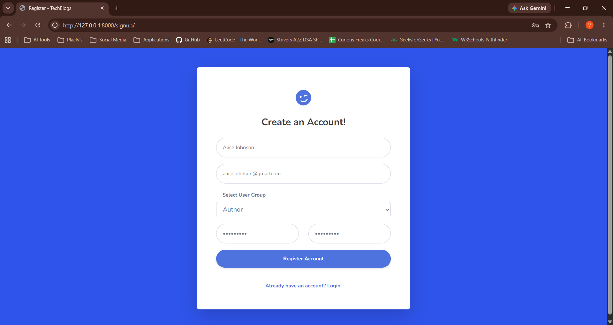

### 2. User Login Page
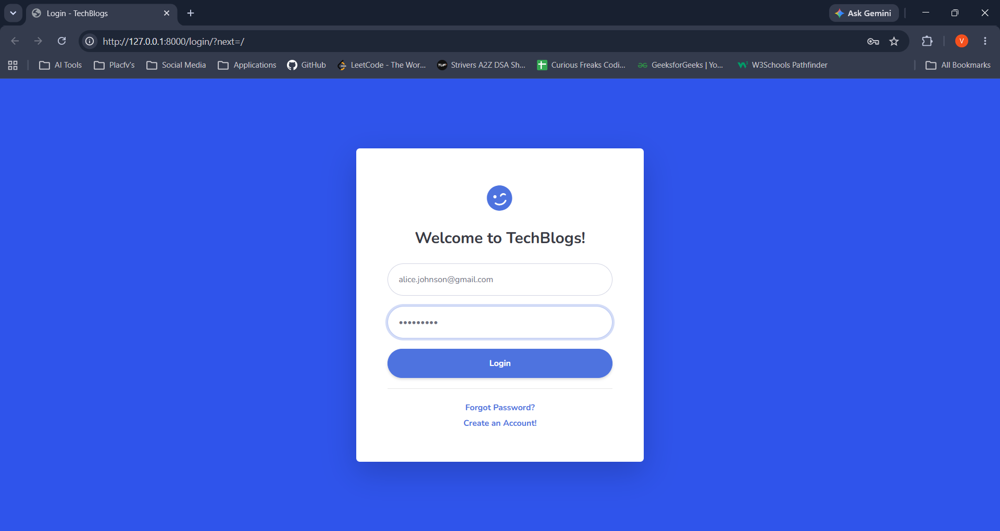

### 3. Forgot Password / Reset Page
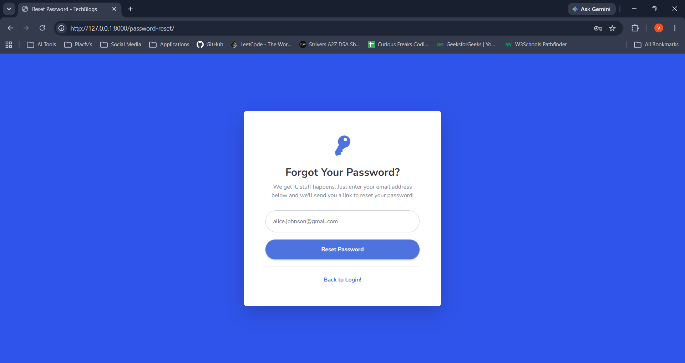
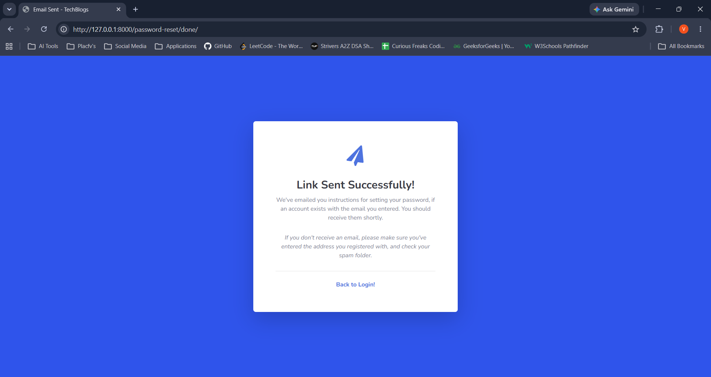
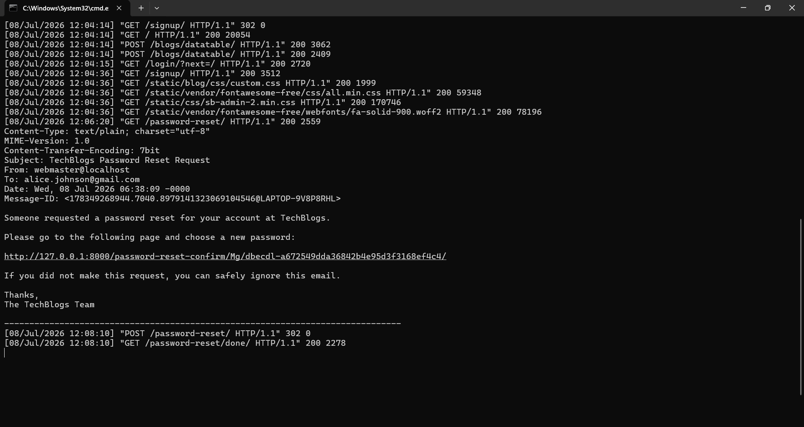
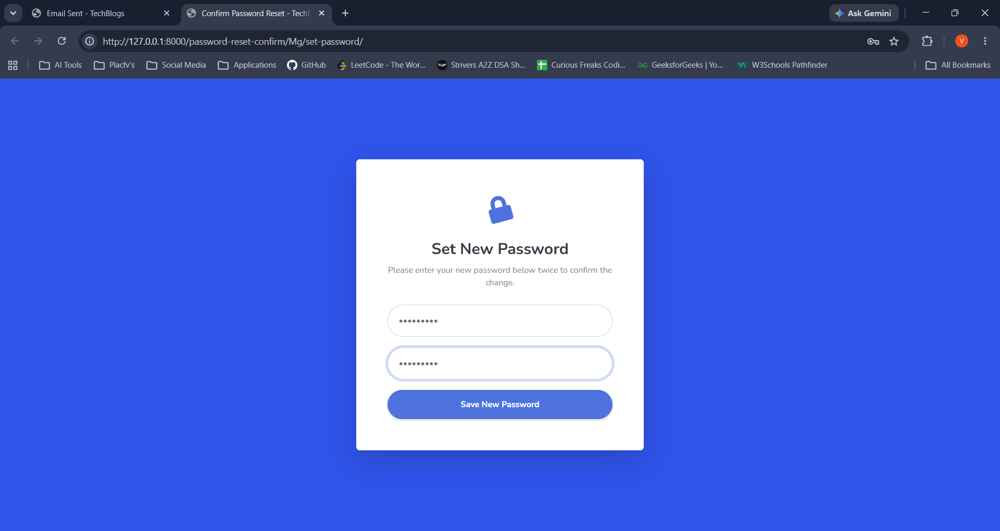
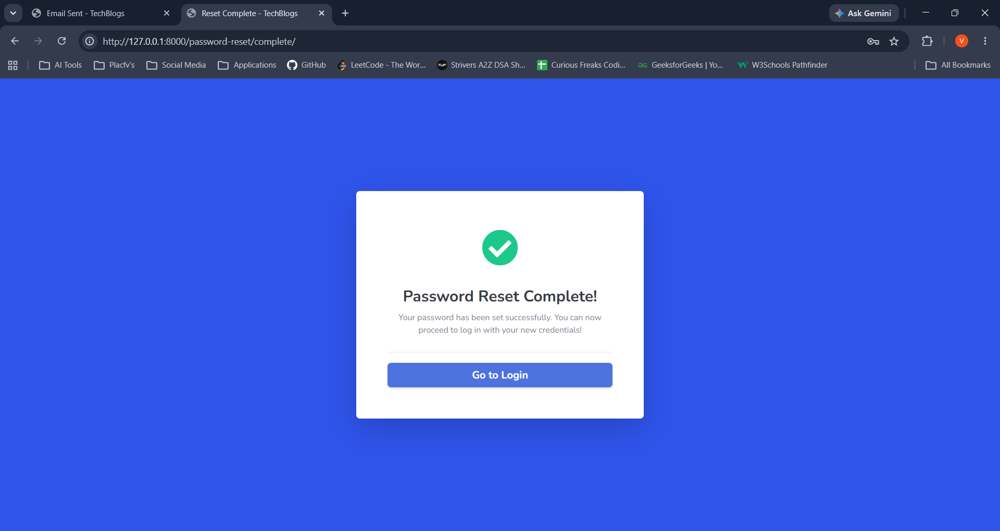

### 4. Blogs Dashboard List
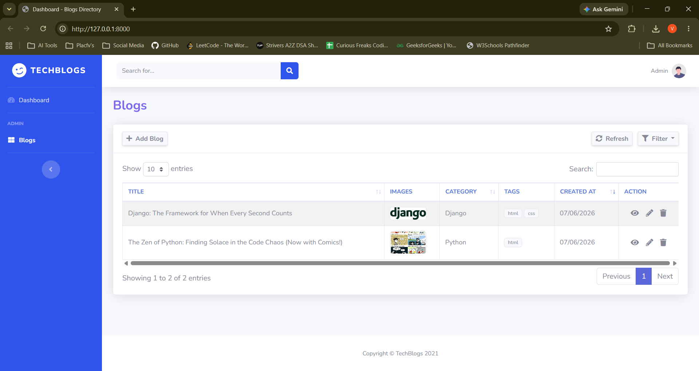

### 5. Create Blog Page
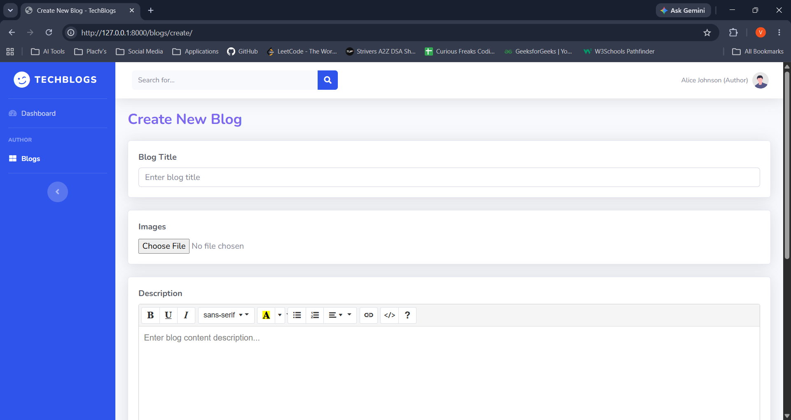
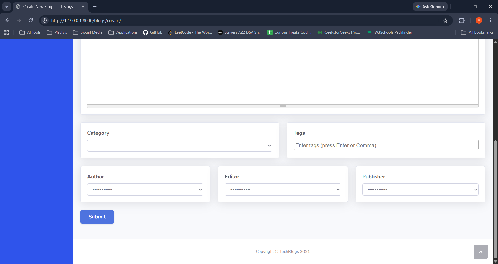

### 6. Edit Blog Modal
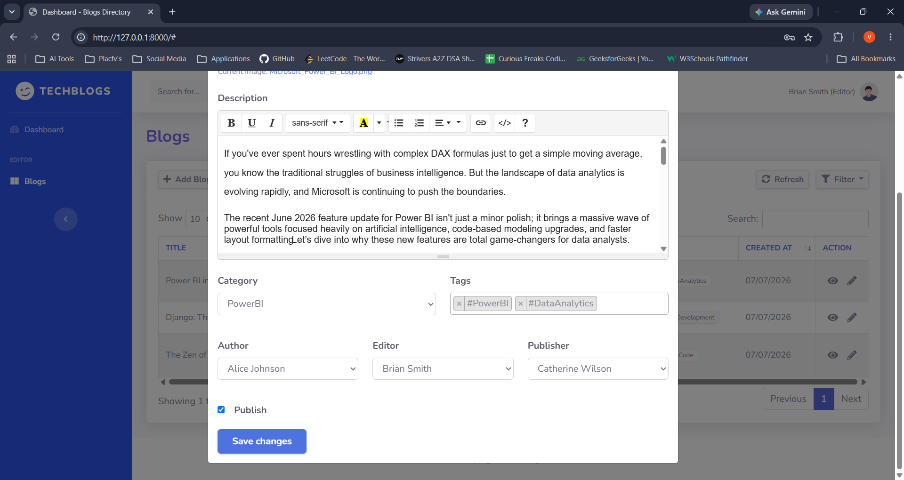

### 7. Blog Details View
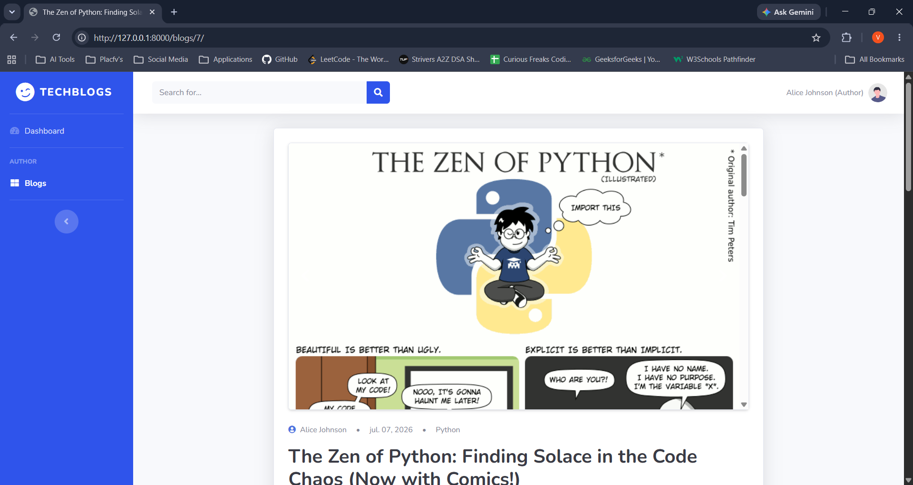

### 8. Success Alerts
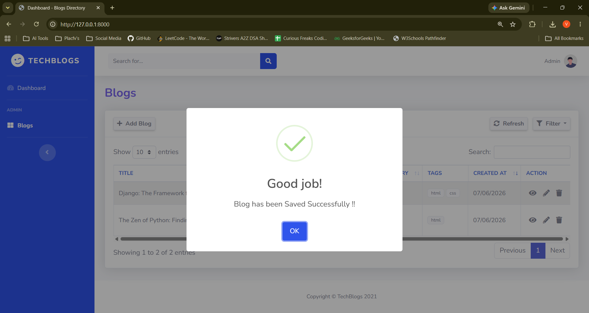

### 9. Delete Alerts
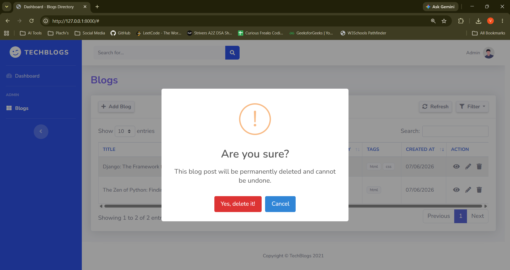

### 10. Celery Worker Logs
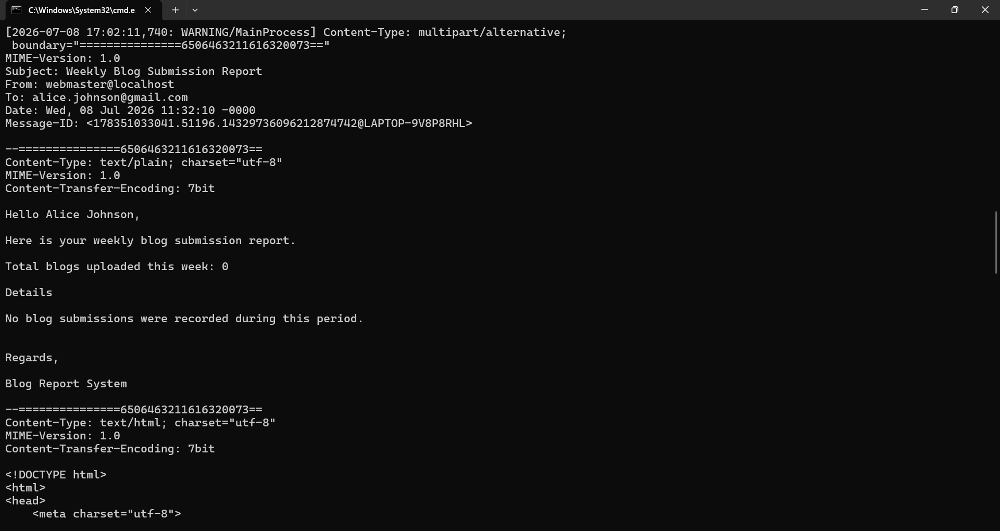

### 11. Celery Beat Schedule
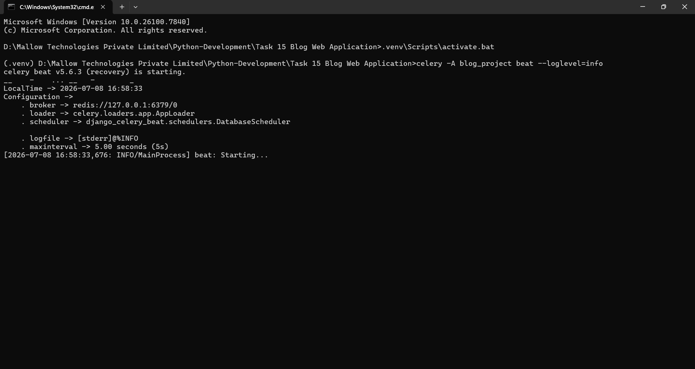

### 12. Management Command Execution
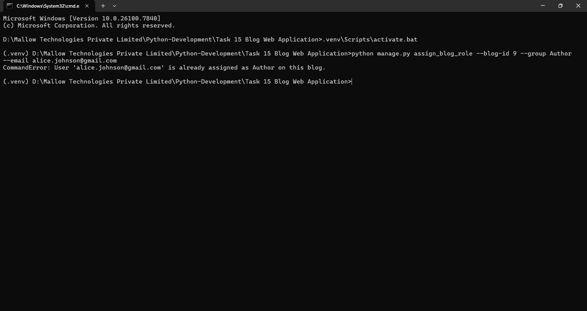

---

## 🛠️ Installation & Setup

Follow these steps to run the project locally on your machine:

### 1. Clone the Repository
```bash
git clone https://github.com/vishalinipg/blog-web-application.git
cd blog-web-application
```

### 2. Initialize Virtual Environment
Create and activate a Python virtual environment:
```powershell
# Create virtual environment
python -m venv .venv

# Activate virtual environment
.venv\Scripts\Activate.ps1
```

### 3. Install Dependencies
Install all required packages (including Celery, Redis, and PostgreSQL support):
```bash
pip install django django-ajax-datatable pillow celery redis django-celery-beat psycopg2-binary
```

### 4. Configure PostgreSQL Database
Ensure a PostgreSQL server is running locally on port 5432. Set your PostgreSQL database password in the environment before running Django commands:
```powershell
# Set environment variable (PowerShell)
$env:DB_PASSWORD="your_postgres_password"

# Set environment variable (CMD)
set DB_PASSWORD=your_postgres_password
```
*(By default, Django connects to a database named `blog_db` with user `postgres` on `localhost`. You can optionally customize these using `DB_NAME`, `DB_USER`, `DB_HOST`, and `DB_PORT` environment variables.)*

### 5. Apply Database Migrations
Apply migrations to build the PostgreSQL database schema and trigger group provisioning signals:
```bash
python manage.py migrate
```

### 6. Create a Superuser
Create an administrative account to access the backend admin panel:
```bash
python manage.py createsuperuser
```

### 7. Run Development Server
Start the local server (make sure your database password environment variable is set in the shell):
```bash
python manage.py runserver
```
Visit `http://127.0.0.1:8000/` in your browser.

### 8. Run Celery Services
Start a local Redis server (default port 6379), then launch Celery worker and scheduler in separate terminals:
```bash
# Start Celery Worker (Windows development recommends solo pool)
celery -A blog_project worker --loglevel=info -P solo

# Start Celery Beat Scheduler
celery -A blog_project beat --loglevel=info
```

---

## 💻 Custom Management Commands

### Role Assignment Command
You can assign or reassign user roles dynamically from the CLI:
```bash
python manage.py assign_blog_role --blog-id <id> --group <Author|Editor|Publisher> --email <user-email> [--dry-run]
```
The command automatically triggers unassignment emails first to any previously assigned user, commits DB updates, and fires assignment emails asynchronously.

Passing `--dry-run` performs all user, blog, and role validations but skips saving changes to the database and sending emails.

---

## 🧪 Running Unit Tests

To run the automated authentication and permission matrix test suite:
```bash
python manage.py test
```

---

## 🗄️ Database Architecture

The `Blog` model consists of the following attributes:
*   `title`: CharField (Blog Title)
*   `content`: TextField (Rich text body description)
*   `image`: ImageField (Cover photo, optional)
*   `category`: CharField (Choices: Python, Django, PowerBI, Scrapy)
*   `tags`: CharField (Comma-separated string tags list)
*   `publish`: BooleanField (Publish status toggle)
*   `author`: ForeignKey (User in `Author` group, optional, `SET_NULL` on delete)
*   `editor`: ForeignKey (User in `Editor` group, optional, `SET_NULL` on delete)
*   `publisher`: ForeignKey (User in `Publisher` group, optional, `SET_NULL` on delete)
*   `created_at`: DateTimeField (Auto-generated timestamp)
*   `updated_at`: DateTimeField (Auto-updated timestamp)

---

## 🔗 URL Routing & API Endpoints

The application registers the following app-namespaced routes:

| URL Pattern | Namespace/View | Description | HTTP Method | Request Type |
| :--- | :--- | :--- | :--- | :--- |
| `/login/` | `accounts:login` | Renders login page and authenticates sessions | `GET`/`POST` | Form |
| `/logout/` | `accounts:logout` | Clears sessions (requires CSRF token) | `POST` | Form |
| `/signup/` | `accounts:signup` | Renders user registration form | `GET`/`POST` | Form |
| `/password-reset/` | `accounts:password_reset` | Renders lookup form to initiate password resets | `GET`/`POST` | Form |
| `/password-reset/done/` | `accounts:password_reset_done` | Shows email link dispatch confirmation page | `GET` | Standard |
| `/password-reset-confirm/<uidb64>/<token>/` | `accounts:password_reset_confirm` | Form to choose a new password | `GET`/`POST` | Form |
| `/password-reset/complete/` | `accounts:password_reset_complete` | Informs user that their password is now updated | `GET` | Standard |
| `/` | `blog:list` | Renders dashboard wrapper and master template | `GET` | Standard |
| `/blogs/datatable/` | `blog:datatable` | Server-side data source for ajax-datatables | `POST` | AJAX (JSON) |
| `/blogs/create/` | `blog:create` | Renders full-page form (GET) / processes creation (POST) | `GET`/`POST` | Form Redirect |
| `/blogs/<int:pk>/edit/` | `blog:edit` | Fetches details (GET) / saves changes (PUT) | `GET`/`PUT` | AJAX (JSON) |
| `/blogs/<int:pk>/` | `blog:detail` | Renders single blog post detail view | `GET` | Standard |
| `/blogs/<int:pk>/delete/` | `blog:delete` | Handles deletion and media file cleanup on disk | `DELETE` | AJAX (JSON) |
| `/api/v1/blogs/` | `blog_api:blog-list` | Retrieve list or create a new blog post | `GET`/`POST` | REST JSON |
| `/api/v1/blogs/<int:pk>/` | `blog_api:blog-detail` | Retrieve, update, or destroy a blog instance | `GET`/`PUT`/`PATCH`/`DELETE` | REST JSON |

---

## 📝 License & Credits

*   Table structures powered by [django-ajax-datatable](https://github.com/c-solidum/django-ajax-datatable).
*   Text formatting editor powered by [Summernote Lite](https://summernote.org/).
*   Multi-select elements styled via [Select2](https://select2.org/).
*   Dashboard layout based on the open-source [SB Admin 2 Template](https://startbootstrap.com/theme/sb-admin-2).
